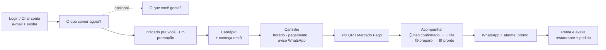
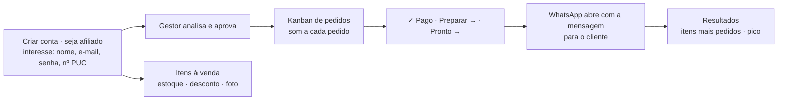

# Jornada de app — FaculFood v8

Layout responsivo: coluna única no celular, grade de 3 colunas no tablet e 6 no computador; abas fixas no rodapé; carrinho flutuante.
Instalável na tela inicial (PWA). Interface sem textos explicativos.

## Primeira tela: login

```
┌──────────────────────────────┐
│          [logo] FaculFood     │
│ ┌─────────┬───────────┬──────┐│
│ │🧑‍🎓Cliente│🏪Restaurante│📊Gestor││
│ └─────────┴───────────┴──────┘│
│  Entrar como cliente          │
│  E-mail  [               ]    │
│  Senha   [               ]    │
│  [        Entrar         ]    │
│  [      Criar conta      ]    │
└──────────────────────────────┘
```
Cada perfil tem **Entrar** e **Criar conta** (restaurante: “seja um restaurante afiliado”; gestor: e-mail @puc-rio.br). O app sempre abre nesta tela (também ao recarregar).

## Cliente


Topo: selo **Cliente** (menu: perfil, trocar, sair). Abas: **Início** · **Lojas** · **Acompanhar** · **Conversar** (converse com o estabelecimento) · **Perfil** (WhatsApp, histórico, avaliar app, apagar conta,
e no fim **Personalizar gosto — opcional**).

## Restaurante


Login → **Itens à venda** (estoque, desconto, foto, ler cardápio por foto). Abas: **Itens** · **Pedidos** (mesmo quadro do cliente) · **Resultados** · **Chat** · **Loja**.

## Gestor (PUC-Rio)

Criar conta (e-mail @puc-rio.br) ou entrar. Abas: **Engajamento** (por vendas, por avaliação ou geral + CSV; NPS do app) · **Restaurantes** (base completa, analisar interesses, aprovar/recusar/suspender, CSV) · **Clientes** (base de clientes, CSV) · **Infraestrutura** (m², balcões, vendas/m², pico) · **Registro**.
