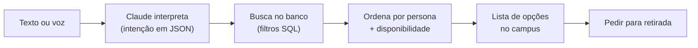
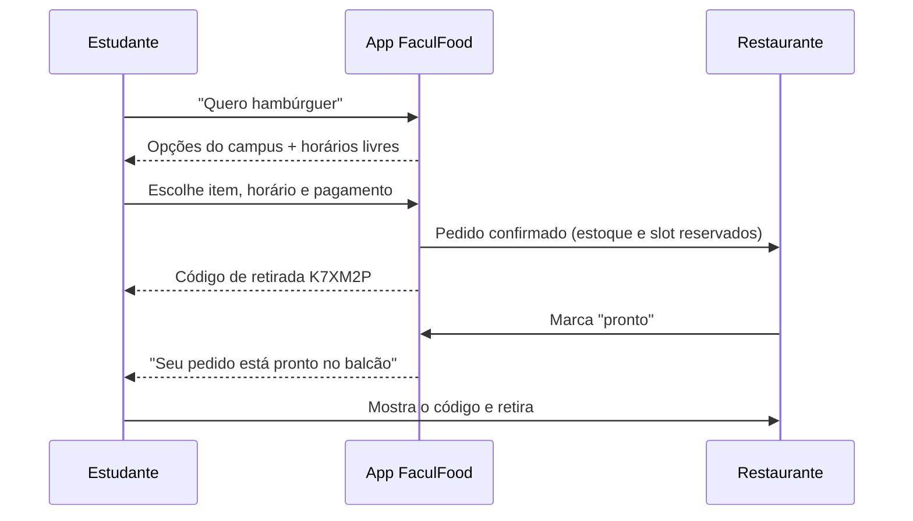
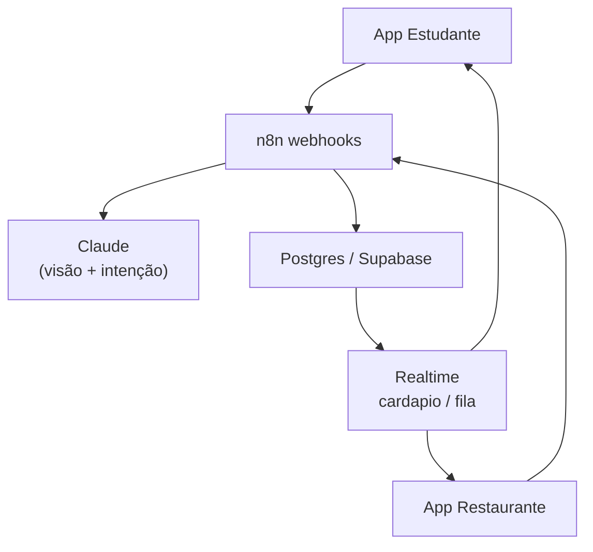

# FaculFood — Proposta completa v4

23/09/2026 · Tatiana

> Cópia em arquivo do documento vivo: https://claude.ai/code/artifact/8a578f11-dad1-4587-b863-5626debb9474
> O que já foi implementado no `index.html` está em `CONTINUAR.md`.

## Resumo executivo

A v4 transforma o FaculFood de um cardápio por restaurante em um app que responde "o que comer agora?" com todas as opções do campus, prontas para retirada. O estudante fala ou digita um desejo ("hambúrguer", "algo leve até R$ 25"), o app lista tudo o que existe no campus, e a lista é ordenada pela persona dele.

Do lado do restaurante, o cardápio nasce de uma foto e o dono controla cada item: venda ligada ou desligada, estoque, preço e desconto. Continua valendo o escopo da v3: só retirada no balcão, preço fechado por unidade, pagamento simulado no protótipo.

Três apostas da v4:

1. **Busca por desejo, não por restaurante.** O ponto de entrada deixa de ser a lista de restaurantes e passa a ser a pergunta "O que comer agora?".
2. **Persona do estudante.** Um perfil de gosto (saudável, fast food, saladas, lanches, doces, café) ordena resultados e alimenta a home.
3. **Restaurante autônomo.** Foto do cardápio, revisão em uma tela, e controle diário de venda, estoque e promoções sem depender da equipe do projeto.

## Ponto de partida

O protótipo atual já cobre o pedido de ponta a ponta dentro de um único restaurante. O que falta é tudo o que cruza restaurantes: busca, comparação, recomendação.

| Capacidade | Protótipo atual (index.html) | Blueprint n8n v3 | v4 (esta proposta) |
| --- | --- | --- | --- |
| Conta de cliente | Usuário + e-mail + senha, localStorage | Cliente anônimo no F4 | Conta com persona e histórico |
| Cardápio | Seed manual, 5 restaurantes | F1: foto → Claude Vision → revisão | F1 + tela de revisão do dono no app |
| Categorias | Livres por restaurante ("Temakis", "Monte seu prato") | 12 categorias fixas | 12 categorias + tags de persona |
| Ligar/desligar item | Sim | Campo `ativo` | Sim, com motivo e horário de volta |
| Estoque | 100 unidades por item, baixa no pedido | Não previsto | Estoque diário, alerta de baixo, esgota sozinho |
| Preço | Edição livre | F2: histórico, teto, confirmação > 30% | F2 mantido |
| Desconto | Não | F3: combos com vigência | F3 + desconto % por item e "happy hour" |
| Pedido | Um restaurante, horário, pagamento simulado, código | F4: slots, capacidade, anti-overbooking | F4 + reserva de estoque |
| Busca entre restaurantes | Não | Não | Busca por desejo em texto ou voz |
| Recomendação | Não | Não | Persona + histórico |

O que se aproveita sem mudança: as 16 barreiras de integridade do blueprint, o prompt de extração do F1 e o fluxo de slots do F4.

## Personas e recomendação

A persona é um vetor de afinidade por perfil de comida, não um rótulo único. Um estudante pode ser 60% saudável e 40% lanche, e isso muda ao longo do semestre.

### As seis personas

| Persona | O que costuma pedir | Sinais no cardápio (tags) | Exemplo do campus |
| --- | --- | --- | --- |
| Saudável | Grelhados, bowls, frutas | `grelhado`, `integral`, `salada`, `fit` | Filé de frango grelhado (Na Medida) |
| Saladas | Saladas montadas, bowls frios | `salada`, `vegetariano`, `vegano` | Salada na medida (Na Medida) |
| Fast food | Burger, pizza, fritos, hot roll | `burger`, `frito`, `empanado`, `pizza` | Roll hot filadélfia (Soba Sushi) |
| Lanches | Salgados, tapioca, crepe, sanduíche | `salgado`, `sanduiche`, `rapido` | Tapioca, Crepe (Cardeal) |
| Doces | Sobremesas, açaí, cookies | `doce`, `acai`, `sobremesa` | Brownie caseiro (Cardeal) |
| Café | Café, matte, combo com pão de queijo | `cafe`, `bebida_quente` | Combo expresso + pão de queijo (Cardeal) |

As tags são geradas no F1 junto com a categoria e revisadas pelo dono. Regra herdada do blueprint: restrição alimentar (vegano, sem glúten) só entra se estiver escrita no cardápio. Tag de persona pode ser inferida pelo nome do prato, porque é gosto, não saúde.

### Como descobrir a persona

1. **Onboarding de 20 segundos.** Três telas de "deslize" com fotos de pratos reais do campus: gostei / não gostei. Seis a nove cartões bastam para o vetor inicial.
2. **Restrições e orçamento.** Duas perguntas opcionais: "tem alguma restrição?" e "quanto costuma gastar no almoço?" (até R$ 20 / 20–35 / 35+).
3. **Aprendizado pelo uso.** Cada pedido soma peso às tags do item; buscas contam menos que pedidos. Peso decai com o tempo, para acompanhar mudança de hábito.
4. **Controle do estudante.** Tela "Meu perfil de gosto" mostra as barras e deixa ajustar ou zerar.

### Como sugerir

Pontuação de cada item disponível agora:

```
score = 0,5 × afinidade + 0,2 × histórico + 0,15 × preço_no_orçamento + 0,1 × promoção + 0,05 × novidade
```

Filtros duros antes do score: item ativo, com estoque, preço não nulo, restaurante aberto no horário de retirada, sem conflito com restrição declarada. A home mostra "Pra você agora" (top 6), "Em promoção perto do seu gosto" e "Experimente" (um item fora da persona, para não prender o estudante numa bolha).

Os pesos são um ponto de partida para ajustar com dados do piloto.

## Busca "O que comer agora?"

A pergunta vira a primeira tela do app: um campo grande com microfone. Logo abaixo, para quem ainda não sabe o que quer, vem a lista de restaurantes do campus, ordenada pelo histórico do estudante e pelas estrelas. As duas opções ficam na mesma tela, sempre. O estudante diz "hambúrguer" e recebe todos os hambúrgueres do campus, de todos os restaurantes, com preço, tempo até a retirada e botão de pedir.

### O que o estudante pode dizer

| Frase | O que o app entende | Resultado |
| --- | --- | --- |
| "hambúrguer" | prato = burger | Todos os burgers ativos, ordenados pela persona |
| "algo leve até 25 reais" | persona = saudável, preço ≤ 25 | Saladas, grelhados, frutas até R$ 25 |
| "sushi pra retirar 12h30" | categoria = japonesa, horário = 12:30 | Só pontos com slot livre às 12:30 |
| "café com pão de queijo" | 2 itens, mesmo ponto | Combos primeiro, depois pares avulsos no mesmo restaurante |
| "doce vegano" | doce + restrição declarada | Só itens com "vegano" escrito no cardápio; se não houver, diz isso |

### Como funciona



O Claude só traduz a frase em filtros (`prato`, `categoria`, `tags`, `preco_max`, `horario`, `restricoes`). Quem decide o que existe é o banco. Assim o app nunca oferece um item que não está no cardápio ou que está esgotado.

### Detalhes que fazem diferença

- **Sinônimos e erros de digitação:** "burger", "hamburguer", "x-burguer" caem no mesmo resultado (busca por texto com `pg_trgm` + sinônimos).
- **Voz:** reconhecimento do próprio navegador (Web Speech API), sem custo extra no protótipo.
- **Resultado vazio honesto:** "Nenhum hambúrguer disponível agora. O Cardeal volta a vender às 14h." em vez de mostrar outra coisa sem avisar.
- **Refinar conversando:** chips abaixo do resultado ("mais barato", "mais rápido", "vegetariano") e a possibilidade de responder "tem algo mais barato?".
- **Resultado agrupado por restaurante:** o carrinho continua sendo de um ponto só (regra `carrinho_misto` do F4); o app avisa ao trocar.

### Promoções em destaque

Item com desconto ganha selo laranja com o percentual, preço antigo riscado e borda própria. Aparece em três lugares: faixa "Em promoção agora" na home, topo dos resultados da busca e página do restaurante. O restaurante com promoção ativa mostra o selo "Tem promoção" na lista.

### Histórico e estrelas, no estilo Netflix

- **Avaliação de 1 a 5 estrelas** depois de cada retirada. A nota média e o número de avaliações aparecem em todo card de restaurante e item.
- **"% combina com você"** em cada item, calculado pela persona, pelo histórico no restaurante, pela nota que o estudante deu e pela nota média.
- **Lista de restaurantes ordenada por preferência:** quantas vezes pediu, a nota que deu e a nota média. O card mostra "você pediu 2× · sua nota ★★★★★".
- **Faixa "Porque você deu 5 estrelas ao Soba Sushi"** com itens parecidos de outros restaurantes.
- **Pedir de novo** em um toque a partir do histórico.

## App do Restaurante

O dono gerencia tudo pelo celular em quatro abas: Cardápio, Estoque, Promoções e Pedidos. Cada ação aparece para o estudante em segundos (canal realtime `cardapio:{ponto}`).

### 1. Cardápio por foto

1. O dono tira foto do quadro ou do cardápio impresso no app.
2. O F1 extrai itens, preços, categoria e tags de persona.
3. O dono vê uma tela de revisão: itens novos, preços que mudaram e itens que sumiram da foto, lado a lado com o recorte da imagem.
4. Um toque aprova tudo o que tem confiança alta; o resto ele corrige ou descarta.

Item que sumiu da foto não é apagado: fica desligado e aparece em "Saíram do cardápio", para o dono confirmar.

### 2. Habilitar a venda de cada item

- Chave liga/desliga por item, com motivo opcional (acabou, fora de horário, fornecedor).
- **Horário de venda por item:** "café da manhã até 11h", "prato do dia só no almoço". O item liga e desliga sozinho.
- **Pausar o restaurante:** um botão para parar de receber pedidos por 15, 30 ou 60 minutos em dia de fila.

### 3. Estoque

- Estoque do dia por item, definido na abertura (com "repetir de ontem").
- Baixa automática quando o pedido é confirmado; volta ao estoque se o pedido for cancelado ou não retirado.
- Alerta quando o item chega a 20% ou a 5 unidades; esgotou, o item mostra "Esgotado" e sai da busca.
- Item sem controle de estoque (ex.: café) pode ficar como "ilimitado".

### 4. Preço e desconto

| Ferramenta | Como funciona | Barreira |
| --- | --- | --- |
| Alterar preço | Edita o valor do item | F2: teto R$ 500, confirmação acima de 30%, histórico |
| Desconto no item | % ou R$ por período, preço antigo riscado | Desconto máximo 70%; vigência obrigatória |
| Happy hour | Desconto em horário fixo (ex.: 15h–17h, doces -30%) | Repete por dia da semana |
| Últimas unidades | Desconto automático quando sobra estoque perto do fechamento | Dono define % e quantos minutos antes |
| Combo | Itens do mesmo ponto com preço fechado | F3: não pode ser mais caro que os avulsos |

Promoções aparecem para o estudante cuja persona combina com o item, o que dá ao dono um motivo concreto para usar a ferramenta.

### 5. Pedidos

Fila por horário de retirada, com status aguardando → em preparo → pronto → retirado. Ao marcar "pronto", o estudante recebe aviso. Busca por código de retirada ou nome, como já existe hoje.

## Jornada do pedido para retirada

Da pergunta ao lanche na mão em cinco passos, sem fila no balcão.



Regras que valem em toda a jornada:

- **Um restaurante por carrinho.** Se o estudante quiser burger de um lugar e suco de outro, são dois pedidos com dois códigos.
- **Horário possível, sempre.** O app só oferece horários que respeitam funcionamento, tempo de preparo e capacidade do slot (F4). Slot lotado mostra as três alternativas mais próximas.
- **Estoque reservado na confirmação.** Dois estudantes não conseguem comprar a última unidade.
- **Não retirado:** 30 minutos após o horário, o pedido vira "não retirado", o estoque volta e o restaurante decide se reaproveita.
- **Pedir de novo:** o histórico em "Meus pedidos" tem botão de repetir, que também alimenta a persona.

## Arquitetura, dados e novos workflows

A v4 mantém a pilha do blueprint (n8n + Postgres/Supabase + Claude) e acrescenta cinco workflows. Os dois apps (Estudante e Restaurante) falam só com os webhooks do n8n e com o realtime do Supabase.



### Novas tabelas e campos

| Tabela | Campos principais | Para quê |
| --- | --- | --- |
| `estudante` | id, nome, email, restricoes[], faixa_orcamento | Conta do cliente (sai do localStorage) |
| `persona_afinidade` | estudante_id, tag, peso, atualizado_em | Vetor de gosto, decai com o tempo |
| `evento_uso` | estudante_id, tipo (busca/pedido/like), item_id, texto | Aprendizado da persona |
| `item` (novos campos) | tags_persona[], estoque_dia, estoque_ilimitado, venda_inicio, venda_fim | Persona, estoque e horário por item |
| `estoque_movimento` | item_id, delta, motivo, pedido_id | Rastro de cada baixa e devolução |
| `desconto` | item_id, tipo, valor, vigencia, recorrencia | Desconto por item, happy hour, últimas unidades |
| `sinonimo` | termo, canonico | "x-burguer" → burger |

### Novos workflows

| # | Nome | Gatilho | O que faz |
| --- | --- | --- | --- |
| F7 | Busca por desejo | POST `/webhook/buscar` | Claude transforma a frase em filtros JSON; SQL busca; ordena por score da persona |
| F8 | Persona | POST `/webhook/persona` + evento de pedido | Grava onboarding; atualiza pesos a cada pedido; decaimento semanal |
| F9 | Estoque | POST `/webhook/estoque` + dentro do F4 | Abertura do dia, baixa em transação com o pedido, devolução, alertas |
| F10 | Descontos | POST `/webhook/desconto` + schedule a cada 5 min | Cria desconto; liga e desliga happy hour e últimas unidades |
| F11 | Disponibilidade por horário | Schedule a cada 5 min | Liga e desliga itens por janela de venda; reabre restaurante pausado |

O F4 ganha um passo entre os nós 9 e 12: `UPDATE item SET estoque_dia = estoque_dia - $qtd WHERE id = $1 AND estoque_dia >= $qtd`. Zero linhas afetadas derruba a transação com 409 `sem_estoque`, igual à barreira de slot.

### Prompt de intenção do F7 (resumo)

Entrada: a frase do estudante e a lista de categorias e tags válidas. Saída: JSON com `prato`, `categorias[]`, `tags[]`, `preco_max`, `horario`, `restricoes[]`, `confianca`. Regras: nunca inventar item ou restaurante; campo não dito é null; restrição só se o estudante disser.

## Riscos e barreiras

As 16 barreiras do blueprint continuam valendo. Estas são as novas, numeradas a partir de 17.

| # | Falha possível | Sem barreira | O que impede |
| --- | --- | --- | --- |
| 17 | Dois estudantes compram a última unidade | Pedido aceito sem comida | F4 + F9: baixa condicional `estoque_dia >= qtd` na mesma transação do slot |
| 18 | Busca por IA "inventa" um prato | Estudante pede o que não existe | F7: Claude só gera filtros; resultado sempre vem do banco |
| 19 | "Vegano" inferido pelo nome | Risco de saúde | Restrição só com texto no cardápio; tag de persona não conta como restrição |
| 20 | Desconto empilhado (item + happy hour + combo) | Preço abaixo do custo | F10: aplica só o maior desconto; teto de 70% |
| 21 | Estoque não volta em pedido cancelado | Item some da busca sem ter acabado | F9: devolução por evento de status, registrada em `estoque_movimento` |
| 22 | Persona presa numa bolha | Estudante só vê o mesmo tipo de comida | Faixa "Experimente" + decaimento dos pesos |
| 23 | Foto nova apaga itens válidos | Cardápio encolhe por foto cortada | F1: item ausente vai para "Saíram do cardápio", só o dono desliga |
| 24 | Dados de gosto expostos | Problema de LGPD | Persona visível só ao próprio estudante; restaurante vê apenas agregados; botão de apagar perfil |

## Roadmap e métricas

Quatro fases de cerca de duas semanas cada. As fases 1 e 2 cabem no protótipo estático atual; a partir da 3 é preciso o back-end.

| Fase | Duração | Entrega | Onde roda |
| --- | --- | --- | --- |
| 1. Busca e persona no protótipo | 2 semanas | Tela "O que comer agora?", busca por texto e sinônimos em todos os restaurantes, onboarding de persona, home "Pra você", tags nos itens do seed | index.html + localStorage |
| 2. Restaurante completo no protótipo | 2 semanas | Horário de venda por item, pausar restaurante, estoque do dia, desconto por item e happy hour, status "pronto" | index.html + localStorage |
| 3. Back-end real | 2–3 semanas | Supabase + n8n F1–F4, F9, F10; contas reais; dois apps compartilhando dados | n8n + Supabase |
| 4. IA e piloto | 2 semanas | F1 foto → cardápio no app do dono, F7 busca com Claude e voz, F8 persona aprendendo; piloto com 3 restaurantes | Campus PUC-Rio |

### Métricas do piloto

| Métrica | Meta inicial |
| --- | --- |
| Buscas que terminam em pedido | ≥ 25% |
| Buscas com resultado vazio | ≤ 10% |
| Pedidos vindos de "Pra você" | ≥ 20% dos pedidos |
| Tempo da foto ao cardápio publicado | ≤ 10 min |
| Pedidos recusados por falta de estoque após confirmados | 0 |
| Restaurantes que usam desconto ao menos 1x/semana | ≥ 50% |

As metas são hipóteses para o workshop, a validar com os primeiros dados.

## Decisões em aberto e próximos passos

Quatro decisões destravam a fase 1:

- [x] Decidido: a tela inicial tem a pergunta "O que comer agora?" e, logo abaixo, a lista de restaurantes.
- [ ] Onboarding de persona obrigatório no cadastro ou opcional ("pular")?
- [ ] Pagamento continua simulado no piloto ou entra Pix real na fase 4?
- [ ] Quais 3 restaurantes topam o piloto (Cardeal, Na Medida, Soba, Strogonoff, Açaí do Wall)?

Próximos passos:

- [x] Adicionar tags de persona aos itens do seed atual
- [x] Implementar busca por texto + sinônimos no index.html (integrada aos cardápios, com voz)
- [ ] Desenhar as três telas de onboarding com fotos reais do campus
- [ ] Escrever o F7 (busca) e o F9 (estoque) no mesmo padrão do blueprint
